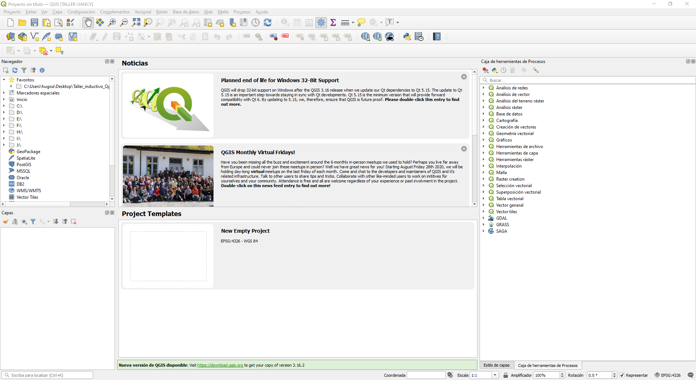

# Instalacion de Software y Complementos

## Instalación de Qgis en Windows

PAra realizar la instalación de Qgis, debemos seguir las siguientes instrucciones:

1. Descargar Qgis desde: <https://qgis.org/es/site/forusers/download.html> (seleccionar la version de Qgis que desee)
2. Ejecutar el instalador, posteriormente `aceptar los terminos de licencia y dejar la configuración por defecto`.

{width='800px' height='500px'}

## Instalación de Qgis en Linux

## Instalación de Comeplementos (Plugins) 

### Instalación de Semi Automatic Clasification Plugin

### Instalación de Map Swipe Tool

### Instalación de Cloud Masking

### Mas Plugins conforme se avance la guia.....

## Intalación de Orfeo Toolbox (OTB)