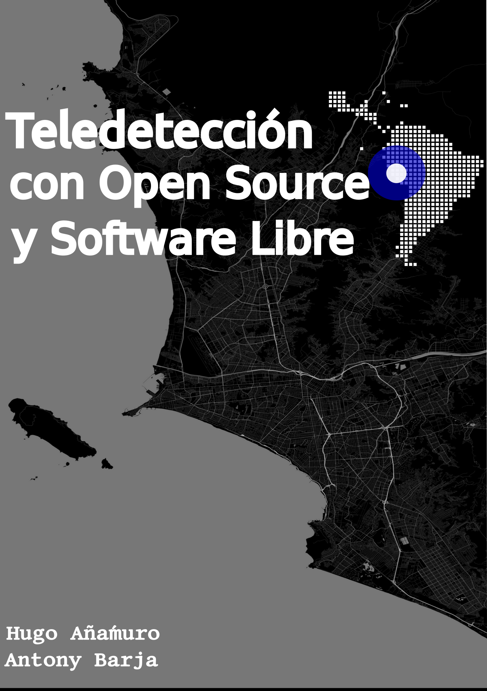

--- 
title: "Teledetección con Open Source y Software Libre"
author: "Hugo Añamuro y Antony Barja"
date: "`r Sys.Date()`"
bibliography:
- book.bib
- packages.bib
description: Esta es una guia de auto entrenamiento para el uso de  **Qgis en el procesamiento digital de imagenes satelitales libres**
  Perú - 2019.
documentclass: book
link-citations: yes
site: bookdown::bookdown_site
biblio-style: apalike
---

# Acerca de esta Guía{-}

 Bajo la constante evolución de las Geotecnologías, la necesidad de tener al alcance herramientas poderosas que nos ayuden al manejo, edición, gestión, visualización, procesamiento y generación de información espacial se vuelve imprescindible.

Existen muchas herramientas Open Source  y libres, entre ellas tenemos [GRASS](https://grass.osgeo.org/), [OBT](https://www.orfeo-toolbox.org/), [SAGA](http://www.saga-gis.org/en/index.html) y [Qgis](https://qgis.org/es/site/); herramientas  que no tienen nada que envidiar a otras herramientas de licencia privativa.

[Qgis](https://qgis.org/es/site/) es una herramienta de sistemas de información Geográfica con la capacidad de trabajar con cada una de las herramientas antes mencionadas de manera integrada bajo un solo entorno, por tal motivo es una herramienta útil para el procesamiento de imágenes satelitales libres como  LandSat, ASTER, Sentinel 2, etc.

Todo el Potencial de Procesamiento de Imágenes satelitales de Qgis se ve mejorado mediante complementos desarrollados para este fin, uno de ellos es SCP (Semi Automatic Clasification Plugin), este mismo tiene varas herramientas para realizar procedimientos van desde  pre - procesamiento hasta el post procesamiento.

Pensando en todo el Potencial de las herramientas Open Source y Software Libre es que se elaboró este libro, con el objetivo de que  la persona que utilice este libro pueda aprender de manera práctica y de la forma más simple posible a procesar imágenes satelitales.

Es necesario precisar que este libro puede ser usado por usuarios de diferentes Sistemas Operativos ya sea Windows y Linux; es por eso que, se presentan ejercicios prácticos enfocados a que el lector pueda seguir paso a paso las funciones y secuencias del procesamiento de imágenes, explicados de la manera más clara posible. 
 

 --- **Los Autores.** 

## Requerimientos Básicos de Hardware {-}

**Requisitos de Hardware:**

1. Capacidad de memoria RAM: 4Gb (se recomienda 8Gb).
2. Tamaño de Disco Duro: 10 GB.
3. Procesador Gráfico: Se recomienda Procesador Gráfico Dedicado con VRAM de 1Gb como mínimo.

